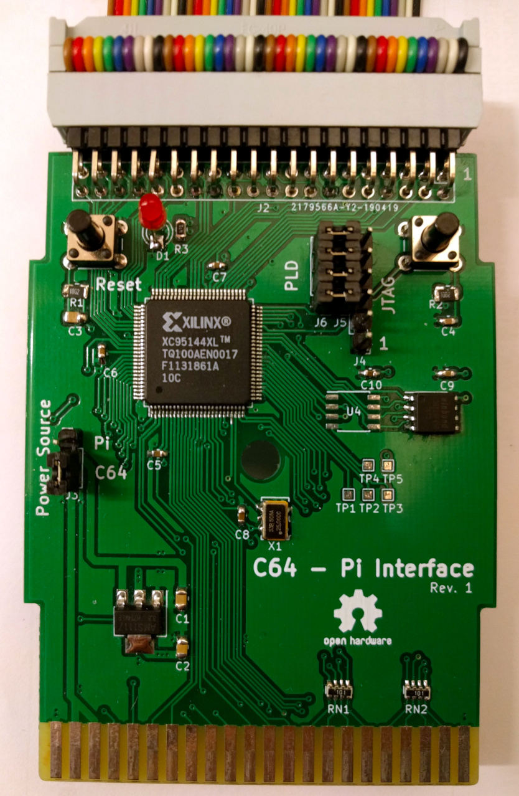
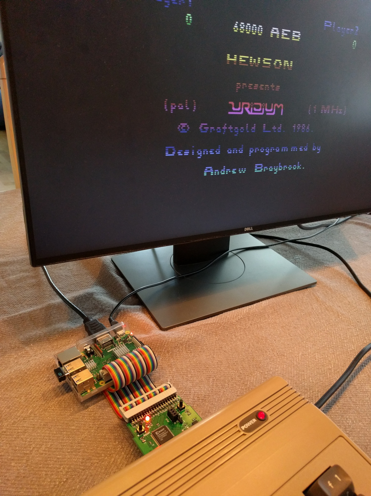
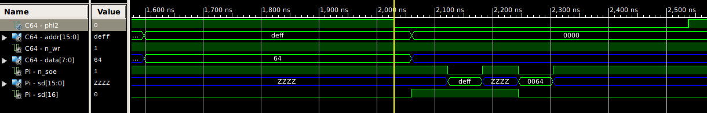

# C64 - Pi Interface

The C64 – Pi Interface gives you the capability to connect your Commodore 64 to an HDMI monitor, using a Raspberry Pi. This project is experimental, and not intended to be used as an end-user product.

This project is inspired by the [RasPIC64 project](https://github.com/frntc/RasPIC64) but with different goals in mind:

- Focus on both video and audio
- Eliminate the need for any addition connections to the C64 besides the Expansion Port
- Use the Pi’s SMI bus and DMA for efficient data transfer
- Support Raspbian, no bare metal OS

... and the result:

## Video and Audio
A modified version of [Frodo V4.1b](https://frodo.cebix.net/) is used for VIC-II and SID emulation running on the Pi. Frodo was chosen for its simplicity but the emulation quality is not as good as VICE.

## Expansion Port Signals Only
The challenge of making a VIC-II and SID emulator using the Expansion Port is similar to the challenge of making a [Kernal Cartridge](https://github.com/KimJorgensen/easyflash/releases/download/EF3-FC3/kernal-cartridge.pdf), mainly that data written to the I/O register $01 of the 6510 CPU is not visible on the data bus.

The following options were considered to solve this challenge:
1. Cheat and require an additional wire from the cartridge to be connected to the motherboard of the C64. This method is used by RasPIC64
2. Manipulate the Expansion Port signals in such way that the value of register $01 can be detected from the cartridge. This method is used by EasyFlash3 (for replacing the kernal).
3. Pause the CPU of the C64 and emulate it on the cartridge (or Pi). This method is used by the [Chameleon](http://wiki.icomp.de/wiki/Chameleon)
4. Emulate the CPU on the Pi in parallel with the one in the C64. This was the chosen method

Option 2 was not chosen as it seems only to work for detecting the kernal mapping, not the I/O area. Option 4 does work, but has some drawbacks:
- The Cassette Connector which is connected to I/O port of the 6510 CPU cannot be used or the emulator will get out of sync with the C64
- The CPU emulator must be very accurate down to the bus level. Currently this is not 100% and not all opcodes are implemented
- It requires additional resources to emulate the CPU on the Pi
- This method requires a continuous stream of data from the C64. If any data is skipped the emulator will get out of sync

## Data transfer
The Raspberry Pi’s SMI (Secondary Memory Interface) bus seems ideal for efficient data transfer of the C64’s Expansion Port signals to the Pi. However, even though a Linux kernel driver exists there is no official documentation for the SMI bus available, which led to a lot of trial and error.

The Linux kernel driver is not used, as it is buggy in some kernel versions and a user space driver gives more control and makes debugging easier. But this makes implementation less efficient as the emulator employs polling to detect when a DMA transfer is complete.

The CPLD firmware on the interface board includes only one register for storing the Expansion Port signals, thus requiring the Pi to read it’s content within each 6510 CPU cycle. Due to the latency involved when configuring the SMI and DMA registers, it is quite tricky to ensure a continuous stream of data without skipping any cycles.

One limitation of using the SMI bus and DMA is the data latency introduced by the FIFOs, which prevents emulation of most C64 cartridges.

## Raspbian
Frodo was modified to use SDL2 to allow the use of hardware acceleration to filter and scale the image to full screen. However, the default SDL2 installation on Raspbian from the Raspberry Pi Foundation does not support hardware acceleration. Instead RetroPie is used which comes with a decent SDL2 installation out of the box.

## Results
It works, but with the limitations described on this page. The video lag when using HDMI seems very low, but no actual test has been made.

The current implementation is quite resource intensive and it barely runs stable on a Raspberry Pi 3 Model B+. Any "interruptions" like connecting to the Pi via SSH will cause the emulator to exit due to not being able to [keep up](https://www.youtube.com/watch?v=cuA8l5gLy7Q) with the data stream from the C64.
It is speculated that moving to bare metal, like RasPIC64, would improve this. Also, an introduction of a FIFO on the interface board would relax the timing requirements a bit.

During start-up of the C64, the emulator synchronizes its VIC-II with the one in the C64 using the BA signal. The current implementation is not perfect and sometimes fails, causing graphical glitches in games.

The reset button on the interface board is not useful at the moment, as a power cycle is required to get the C64 synchronized with the emulator.

So what’s the deal with the SPI flash and RAM on the interface board?
That’s for an experiment another day and it is not certain if this ever will be useful. The footprint for the flash is also of the wrong size. Not being a hardware designer there are likely other mistakes made.
